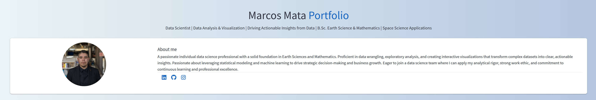

<p align="center">
  <a href="YOUR_LIVE_DEMO_LINK_HERE" target="_blank">
    
  </a>
</p>

<h3 align="center">🚀 Elevating My Data Science Journey: A Showcase of Projects & Skills</h3>

<p align="center">
  Built with ❤️ using <b>Streamlit</b>, <b>Python</b>, and the elegant styling of <b>MaterializeCSS</b>.
</p>

<p align="center">
  <a href="https://opensource.org/licenses/MIT" target="_blank">
    
  </a>
  <a href="https://marc121mata-portfolio.streamlit.app/" target="_blank">
    
  </a>
</p>

---

👋 Hello there! This repository hosts the source code for my personal portfolio web application, a dynamic showcase of my data science projects, skills, educational background, STEM outreach endeavors, and ways to connect.

Inspired by the elegant design and functionality demonstrated in [gcastano's Streamlit Portfolio](https://github.com/gcastano/Streamlit-Demo-Apps/tree/main/streamlitPortfolio), I've tailored this web app to reflect my unique journey and accomplishments in the world of data science.

✨ **Key Features:**

* **My Skills:** A visually engaging display of my technical proficiencies and areas of expertise.
* **My Projects:** An in-depth look at the data science projects I've undertaken, highlighting methodologies, technologies used, and outcomes.
* **Education:** Details about my academic background.
* **STEM Content Creation & Outreach:** Showcasing my contributions to the STEM community through content creation and outreach activities.
* **Contact:** Easy ways to get in touch with me for collaborations or opportunities.

🛠️ **Built With:**

* **Streamlit:** The magic framework that makes building interactive web apps purely in Python a breeze.
* **Python:** The versatile and powerful language at the heart of all the logic and functionality.
* **MaterializeCSS:** A modern responsive CSS framework that provides a clean and intuitive user interface.

🚀 **Live Demo:**

Check out the live version of my portfolio web app [HERE](https://marc121mata-portfolio.streamlit.app/).

💻 **Installation (for local development):**

1.  **Clone the repository:**
    ```bash
    git clone [https://github.com/YOUR_GITHUB_USERNAME/YOUR_REPOSITORY_NAME.git](https://github.com/YOUR_GITHUB_USERNAME/YOUR_REPOSITORY_NAME.git)
    cd YOUR_REPOSITORY_NAME
    ```

2.  **Install the required dependencies:**
    ```bash
    pip install -r requirements.txt
    ```
    *(Make sure you have a `requirements.txt` file listing `streamlit` and any other Python libraries you used)*

3.  **Run the Streamlit app:**
    ```bash
    streamlit run portfolio.py
    ```
    *(Replace `portfolio.py` with the name of your main Python script)*

📄 **License:**

This project is licensed under the [MIT License](https://opensource.org/licenses/MIT). Feel free to use, modify, and distribute it as per the terms of the license.

🙏 **Acknowledgements:**

A big thank you to [gcastano](https://github.com/gcastano) for the inspiring Streamlit Portfolio template that served as a foundation for this project.

---

Let's connect! You can find me on:

* [LinkedIn](https://www.linkedin.com/in/marcos-mata-4986a2349)
* [GitHub](https://github.com/Mata13)
* [Instagram](https://www.instagram.com/space.marc_stjarnstoft/?igsh=aHNyZzdjZ2Zvd204&utm_source=qr#)

Feel free to explore the code, contribute (if you're interested!), or reach out with any questions or opportunities.

Happy coding! 🚀
